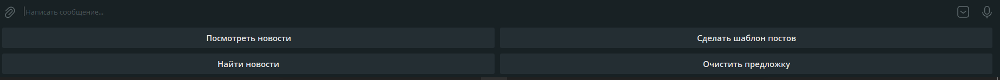
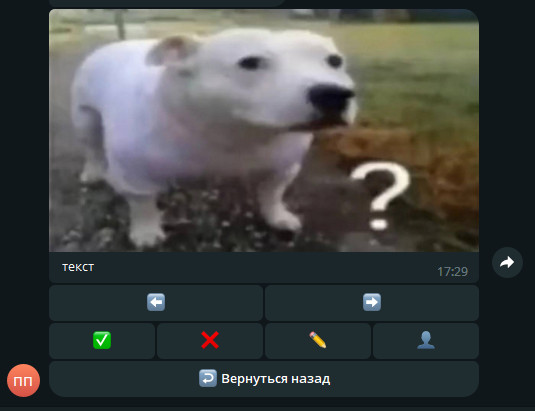
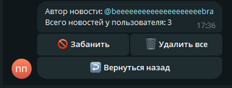
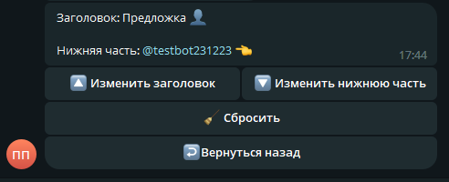
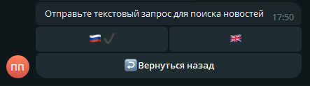
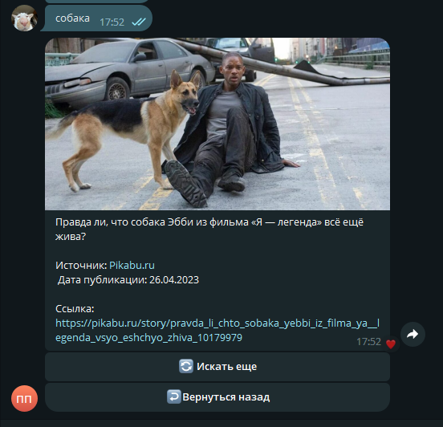
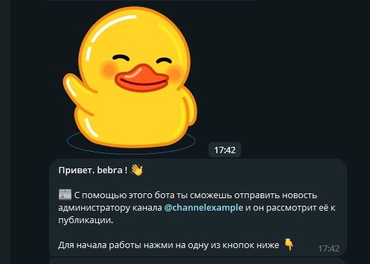
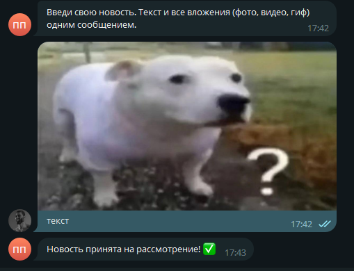
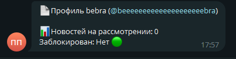

# Platinum News Bot

Менеджер новостей для телеграм-канала и функция предложки

# Команды администратора

При запуске бота отправляется стартовое сообщение и доступна клавиатура с 4 кнопками.

## Посмотреть новости

При выборе данной кнопки администратор может просматривать новости, хранящиеся в базе данных. Сообщение отображает
вложения, а также текст новости.

Кнопки инлайн клавиатуры:

* Стрелки влево-вправо нужны для выбора новостей
* Кнопка с галочкой запостит новость в канал и удалит ее из базы данных
* При нажатии кнопки с карандашом, администратор может ввести новый текст новости, после чего новость будет отправлена в
  канал
* При нажатии кнопки профиля, можно просмотреть информацию об авторе новости, забанить его или удалить все предложенные
  им новости
* Нижняя кнопка возвращает в главное меню

> Профиль автора новости

## Сделать шаблон постов

При выборе этой кнопки администратор может задать заголовок и нижнюю часть для своих постов

## Найти новости

При выборе этой кнопки администратор может найти новости на английском или на русском языке,
используя [News API](https://newsapi.org/).

## Очистить предложку

Кнопка очищает базу данных новостей

# Команды пользователя

## Предложить новость

Команда позволяет отправить новость администратору

## Профиль

Команда показывает информацию о профиле пользователя

# Текстовые команды

## /ban @username

Банит пользователя с юзернеймом @username

## /unban @username

Разбан пользователя с юзернеймом @username

## /change_perm

Функция для тестирования бота - меняет права на пользователя или на админа